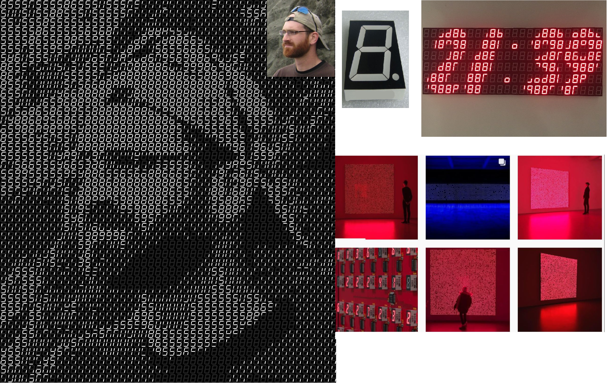

# LED mosaic

This project was inspired by the following post from [Nick Loomis](https://loomsci.wordpress.com/2013/06/19/segmented-display-images/). The idea is to create a [photomosaic](https://en.wikipedia.org/wiki/Photographic_mosaic) built from those little 7-segment digit displays that you commonly find on microwaves, ovens, etc.

This is best explained with the following image:

## First stage - replicating results

As a first step, I want to just re-create the results of Nick Loomis. He used 3 approaches:

1. ### Brightness representation

- Create candidate tiles which are each combination of LED segment on/off (2^7 == 128)
- Divide reference image into blocks with size equal to candidate tiles
- Calculate average brightness of each reference image block and choose candidate tile which has the closet brightness

2. ### Nearest neighbor feature matching

- Uses previous approach but instead of matching brightnesses, calculate vector distances of reference image blocks
- Choose candidate tile which has the minimum distance from the reference blocks (using e.g. L2-norm)

3. ### Mini-block averaging

- Uses a combination of previous approaches by first dividing the reference blocks and candidate tiles into smaller mini-blocks
- Calculate the average pixel value within each mini-block and choose candidate tile with minimum distance

Once I can experiment with these 3 techniques and am happy with the way the photomosaic looks for static images, I will move on to the second stage.

## Second stage - camera feed

Here, I'll create a real-time rendering of a camera/webcam feed and display it to the user. The main challenge here is latency. I want the transformed camera feed to update quick enough so that there is no noticeable lag between itself and the raw feed.

## Third stage - physical system

This stage is a bit of a stretch goal. I want to create a physical system that performs the mosaic-generating algorithm using real 7-segment LED digits. The idea would be to cover a large portion of a wall with a lot of 7-segment displays. A camera will be on top which will render the scene in front using the mosaic images and display this to the wall of digits. You can get a feel for how this would look on the bottom-right of the [concept image](images/concept.png). 

A few major challenges with this are:

- **cost**: 7-segment displays are not very cheap, especially at the resolution I would require
- **power**: you typically want at least 10 mA of current through a single segment, and so this number blows up at scale
- **latency**: we need to have a quick refresh rate of the large digit grid, otherwise the scene displayed will lag behind the actual feed

If I do tackle this stage, I would love to display it as an art installation somewhere. I think it would be pretty cool to see a real-time rendering of yourself as a 7-segment display mosaic. 